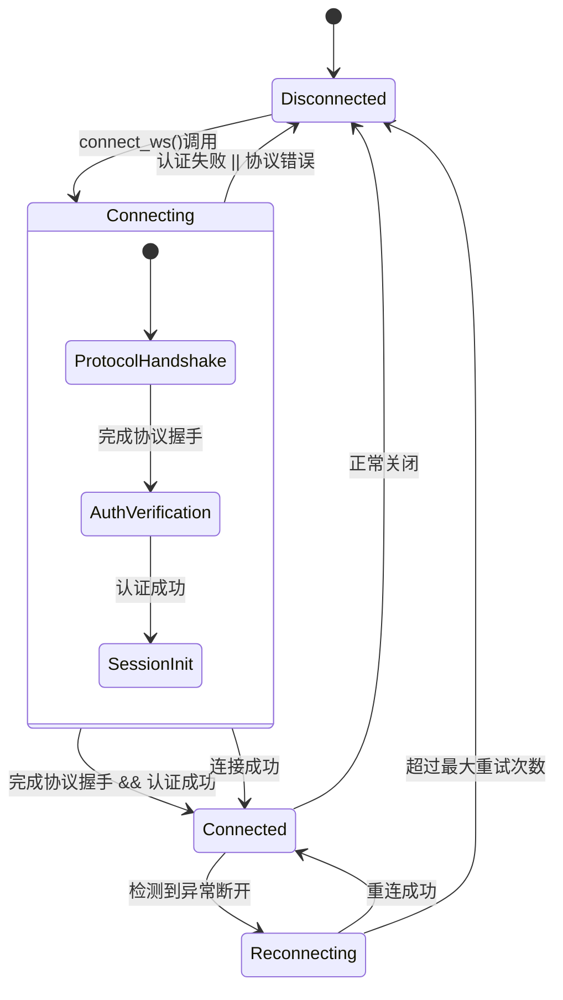
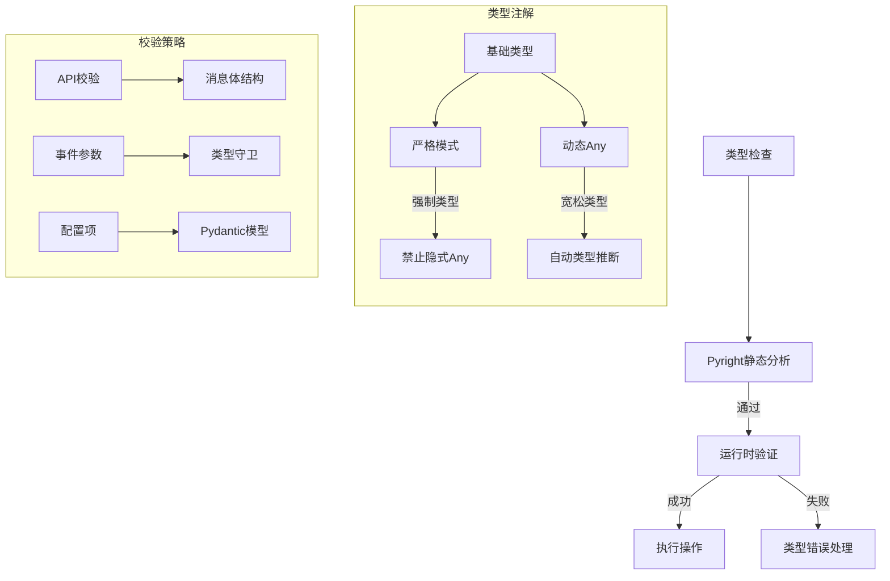
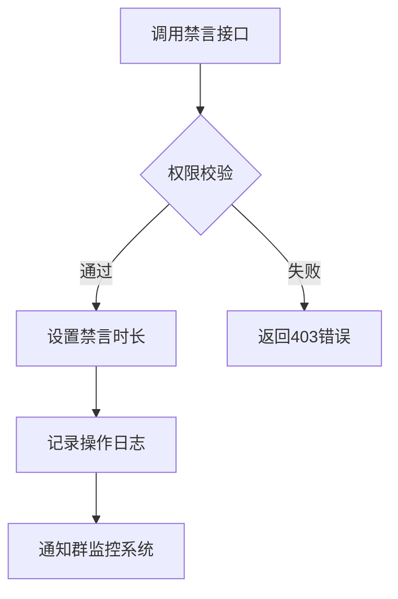
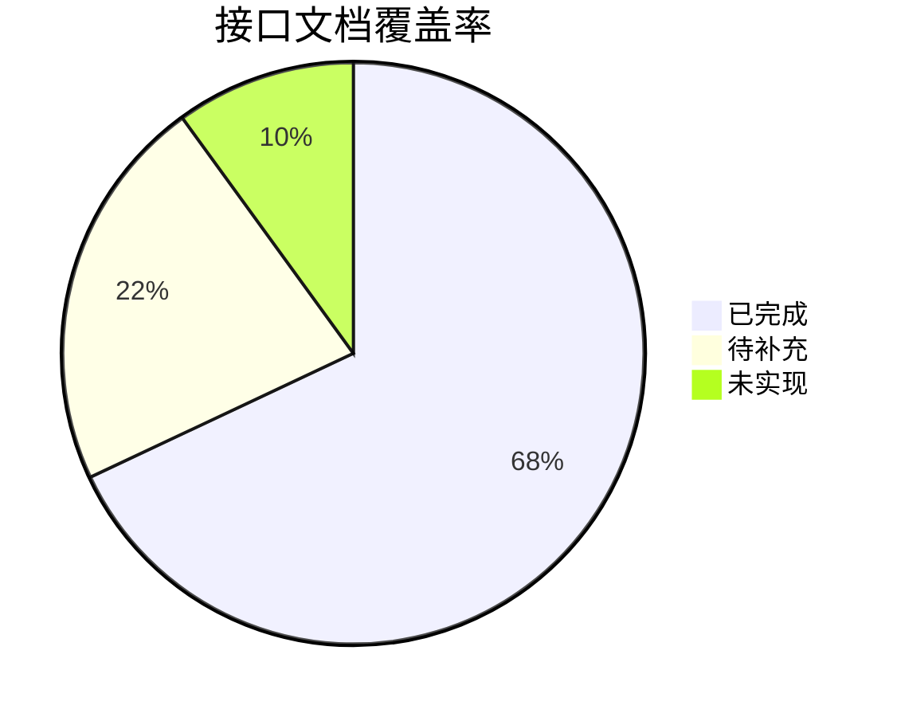
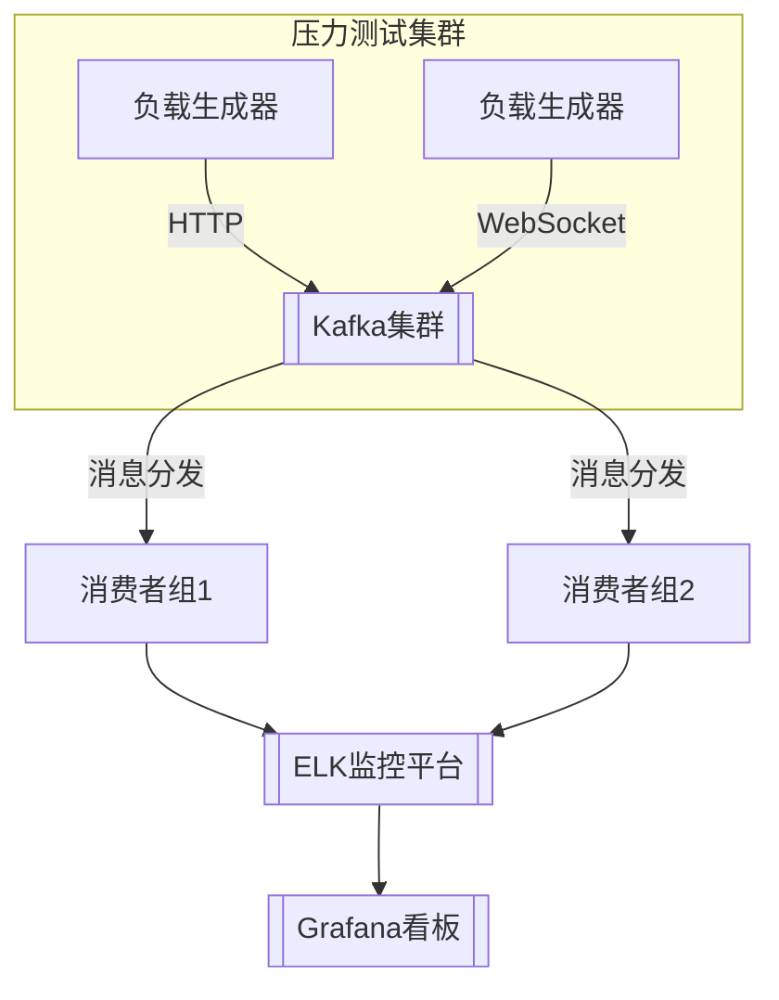
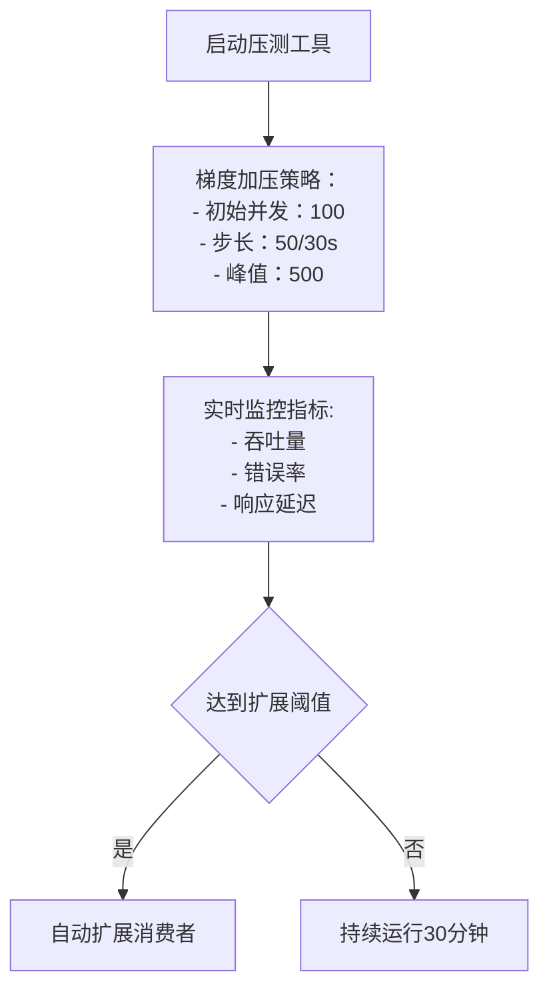
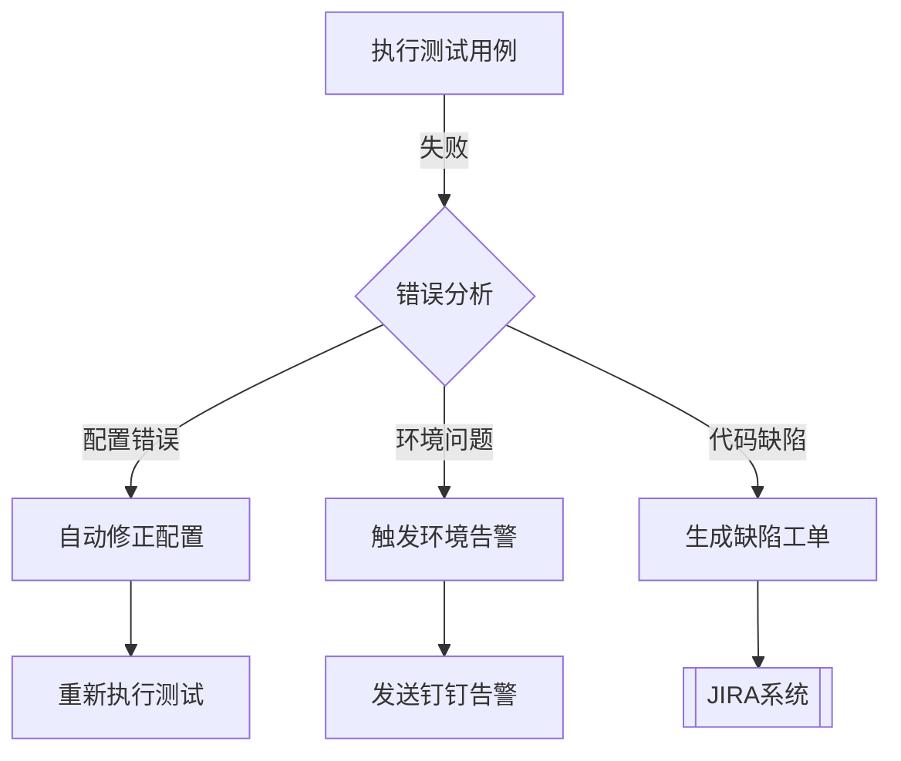

## WebSocket连接状态转换图


## 类型系统设计
```mermaid
flowchart TB
    TypeCheck[类型检查] --> Pyright[Pyright静态分析]
    Pyright -->|通过| Runtime[运行时验证]
    Runtime -->|成功| Execution[执行操作]
    Runtime -->|失败| Error[类型错误处理]
    
    subgraph 类型注解
        direction TB
        Base[基础类型] --> Strict[严格模式]
        Base --> Dynamic[动态Any]
        Strict -->|强制类型| NoImplicitAny[禁止隐式Any]
        Dynamic -->|宽松类型| AutoCast[自动类型推断]
    end

    subgraph 校验策略
        direction LR
        API校验 --> 消息体结构
        事件参数 --> 类型守卫
        配置项 --> Pydantic模型
        类型守卫 -->|运行时检查| TypeGuard[类型守卫装饰器]
        Pydantic模型 -->|字段校验| FieldValidation[字段级验证]
    end

## WebSocket连接状态转换图
```mermaid
%%{init: {'themeVariables': {'primaryColor': '#3f51b5','secondaryColor': '#7986cb'}}}%%
stateDiagram-v2
    [*] --> Disconnected
    state Connecting {
        [*] --> ProtocolHandshake
        ProtocolHandshake --> AuthVerification: 完成协议握手
        AuthVerification --> SessionInit: 认证成功
    }
    Disconnected --> Connecting: connect_ws()调用
    Connecting --> Connected: 完成协议握手 && 认证成功
    Connecting --> Disconnected: 认证失败 || 协议错误
    Connecting --> Connected: 连接成功
    Connected --> Reconnecting: 检测到异常断开
    Reconnecting --> Connected: 重连成功
    Reconnecting --> Disconnected: 超过最大重试次数
    Connected --> Disconnected: 正常关闭
```

## 类型系统设计


当前系统采用渐进式类型校验策略：
1. 接口层：使用Pydantic进行请求/响应模型验证
2. 业务逻辑层：通过Pyright进行静态类型检查
3. 运行时：关键路径添加类型守卫（TypeGuard）
4. 异步任务：使用@beartype进行运行时类型校验

### 类型守卫示例
```python
from typing import TypeGuard, TypedDict

class MessageSegmentDict(TypedDict):
    """消息段类型定义"""
    type: str
    data: dict[str, str | int | float | bool]

# 类型别名提高可读性
MessageSegmentList = list[MessageSegmentDict]

def is_valid_message_segment(seg: dict) -> TypeGuard[MessageSegmentDict]:
    """验证消息段结构：
    1. 必须是字典类型
    2. 必须包含type字段且为字符串
    3. 必须包含data字段且为字典
    4. data字段值只能是基本类型"""
    return (
        isinstance(seg, dict) and
        isinstance(seg.get('type'), str) and
        isinstance(seg.get('data'), dict) and
        all(isinstance(v, (str, int, float, bool)) for v in seg['data'].values())
    )

def validate_message_chain(chain: list[dict]) -> MessageSegmentList:
    """校验整个消息链：
    1. 每个消息段必须通过is_valid_message_segment检查
    2. 返回带类型注解的结果"""
    if invalid_segs := [seg for seg in chain if not is_valid_message_segment(seg)]:
        raise TypeError(f"无效的消息段: {invalid_segs}")
    return chain  # 类型注解确保返回正确类型

# 消息段工厂函数
def create_message_segment(
    type: str, 
    data: dict[str, str | int | float | bool]
) -> MessageSegmentDict:
    """创建类型安全的消息段"""
    return {"type": type, "data": data}
```

### 校验策略配置
```yaml
type_checking:
  strict: true
  check_untyped_defs: true
  implicit_reexport: false
  report_any: error
  type_guard:
    enabled: true
    check_parameter_types: true
    check_return_type: true
```

### 类型校验最佳实践
```python
# 使用类型别名提高代码可读性
from typing import Dict, List, Union

MessageSegmentDict = Dict[str, Union[str, int, float, bool]]
# 使用泛型容器类型
from typing import TypeVar
T = TypeVar('T', bound=MessageSegmentDict)

def validate_message_segment(seg: T) -> T:
    """泛型类型校验装饰器"""
    if not isinstance(seg, dict) or 'type' not in seg or 'data' not in seg:
        raise ValueError("Invalid message segment format")
    return seg

# 使用PEP 647 TypeGuard
def is_text_segment(seg: MessageSegment) -> TypeGuard[dict[str, str]]:
    """类型守卫检查文本消息段"""
    return seg.get('type') == 'text' and isinstance(seg.get('data', {}).get('text'), str)
```

## 事件分发机制
```mermaid
flowchart TB
    subgraph 消息队列
        EventQueue[[事件队列]]
        BacklogQueue[[积压队列]]
    end

    Listener[监听服务] -->|推送事件| EventQueue
    
    subgraph 积压处理
        EventQueue -->|队列满载| BacklogHandler[积压处理器]
        BacklogHandler -->|增加消费者| ScaleOut[横向扩展]
    ScaleOut -->|配置示例| ScaleConfig[scale_config.yaml]

```yaml
# scale_config.yaml
horizontal_scaling:
  max_consumers: 10
  scaling_strategy: latency_based
  dynamic_adjustment:
    consumer_increment: 20%
    cooldown_minutes: 5  # 扩容冷却时间，防止频繁扩缩容
  thresholds:
    cpu: 80%  # CPU使用率阈值（触发一级扩容）
    latency_ms: 500  # 处理延迟阈值（触发二级扩容）
    queue_depth: 1000  # 队列深度阈值（触发三级扩容）
    backlog_timeout: 30s  # 积压处理超时时间
    max_retention: 1h  # 事件最大保留时间
```
        BacklogHandler -->|丢弃旧事件| EventCleaner[事件清理]
    end

    EventQueue -->|取出事件| Dispatcher[事件分发器]
    Dispatcher -->|匹配处理器| HandlerRegistry[处理器注册表]
    HandlerRegistry -->|查找处理器| _event_handlers
    subgraph NapcatClient
        _event_handlers[[_event_handlers字典]]
        _call_event_handlers[_call_event_handlers方法]
    end
    _call_event_handlers -->|异步执行| Coroutine[协程任务]
    Coroutine -->|异常处理| ErrorHandler[错误回调]

    Dispatcher -->|权重配置| WeightConfig[权重配置文件]
    WeightConfig -->|加载配置| {
        "handler_weights": {
            "message_handler": 60,
            "notification_handler": 30,
            "system_alert_handler": 10
        },
        "auto_adjust": true
    }

    Dispatcher -->|策略更新| HotUpdate[热更新服务]
    HotUpdate -->|加载新配置| Dispatcher
```

### 运行时策略热更新
```python
# 动态更新事件路由策略示例
client.update_dispatch_rules(
    rule_type="message",
    new_routes=[
        {"priority": 1, "matcher": "content_contains('紧急')", "handler": "emergency_handler"},
        {"priority": 2, "matcher": "user_role('VIP')", "handler": "vip_handler"}
    ]
)
```

## API配置参数
### ClassVar类型注解示例
```python
class NapcatAPI(BaseModel):
    # ClassVar类型注解
    WS_CLIENT: ClassVar[str] = "WS/CLIENT"
    MAX_RETRIES: ClassVar[int] = 5  # 最大重试次数
    RECONNECT_INTERVAL: ClassVar[float] = 1.0  # 基础重连间隔
    HTTP_CLIENT: ClassVar[str] = "HTTP/CLIENT"
    metadata: ClassVar[dict[str, "NapcatAPI"]] = {}
```

### 多环境配置示例

### 环境变量优先级规则
```yaml
config_priority:
  1: environment_variables
  2: config_override.yaml
  3: default_config.yaml

variable_mapping:
  MAX_CONSUMERS: scaling.max_consumers
  QUEUE_DEPTH: queue_settings.max_depth
```
```yaml
# 多环境配置模板
environments:
  development:
    max_consumers: 5
    queue_depth: 500
    latency_threshold: 1000

  production:
    max_consumers: 20
    queue_depth: 2000
    latency_threshold: 300
```

### 参数验证流程
```mermaid
flowchart LR
    Validate[配置验证] --> ProtocolCheck{协议版本校验}
    ProtocolCheck -->|v2| TypeCheck{类型检查}
    ProtocolCheck -->|v1| LegacyCheck{旧版校验}
    TypeCheck -->|pyright验证| PyCheck[静态类型检查]
    PyCheck -->|通过| RangeCheck{范围验证}
    PyCheck -->|失败| Error0[抛出TypeError]
    TypeCheck -->|失败| Error1[抛出TypeError]
    RangeCheck -->|通过| FormatCheck{格式校验}
    RangeCheck -->|失败| Error2[抛出ValueError]
    FormatCheck -->|通过| SecurityCheck[安全校验]
    SecurityCheck -->|通过| Apply[应用配置]
    SecurityCheck -->|失败| Error4[抛出SecurityError]
    FormatCheck -->|失败| Error3[抛出FormatError]

### 新增校验规则
| 参数类型 | 安全规则 | 状态码 |
|----------|----------|--------|
| API密钥 | 正则匹配 | 401    |
| 文件路径 | 防注入检测| 403    |
| URL参数 | XSS过滤  | 422    |
```

### API接口详解
### 账号管理接口
#### get_login_info 获取登录信息
```python
# 功能：获取当前登录账号信息
# 响应示例
{
  "user_id": 3481455217,
  "nickname": "NapCat",
  "status": "online"
}

# 使用示例
async def get_bot_info():
    async with httpx.AsyncClient() as client:
        response = await client.get(
            "http://localhost:10143/get_login_info",
            headers={"Authorization": "Bearer 10143"}
        )
        return response.json()
```

### 消息收发接口
#### send_group_msg 发送群聊消息
```python
# 参数规范
payload = {
    "group_id": 123456789,  # 目标群号
    "message": {
        "type": "text",
        "data": {"text": "@全体成员 紧急通知"}
    },
    "auto_escape": false  # 是否解析CQ码
}

# 消息类型支持矩阵
| 消息类型       | 支持 | 限制条件                 |
|----------------|------|--------------------------|
| 文本          | ✓    | 长度≤5000字符           |
| 图片          | ✓    | 大小≤20MB               |
| 合并转发      | ✓    | 需预先创建转发节点       |
| 语音          | ✓    | 仅限AMR格式             |

# 错误处理示例
try:
    await send_group_msg(123456789, "系统维护通知")
except APILimitExceeded:
    logger.warning("触发频控限制，等待重试...")
    await asyncio.sleep(60)
```

#### send_private_msg 发送私聊消息
```python
# 参数规范
payload = {
    "user_id": 2418701971,  # 接收者QQ
    "message": {
        "type": "text",
        "data": {"text": "测试消息"}
    },
    "message_id": null  # 可选消息ID
}

# 错误处理示例
try:
    await send_private_msg(2418701971, "紧急通知！")
except APIError as e:
    logger.error(f"消息发送失败: {e.code}-{e.message}")
    if e.code == 429:
        await exponential_backoff_retry()
```

### 群组操作接口
#### set_group_ban 群组禁言


**参数规范**
| 参数名    | 类型   | 必填 | 说明                  | 示例值       |
|-----------|--------|------|-----------------------|--------------|
| group_id  | int64  | 是   | 目标群号              | 123456789    |
| user_id   | int64  | 是   | 目标成员QQ号          | 2418701971   |
| duration  | int    | 否   | 禁言时长(秒) 默认600  | 1800         |

**错误代码**
```python
# 异常处理示例
try:
    await set_group_ban(123456789, 2418701971, 1800)
except PermissionError:
    logger.warning("权限不足，请检查管理员身份")
except GroupNotFound:
    logger.error("群组不存在或已解散")
```

### 文件管理接口
#### upload_group_file 群文件上传
| 参数        | 类型    | 必填 | 说明                     | 示例值               |
|-------------|---------|------|--------------------------|----------------------|
| group_id    | int64   | 是   | 目标群号                 | 123456789            |
| file_path   | string  | 是   | 本地文件绝对路径         | "C:/data/test.txt"  |
| name        | string  | 否   | 云端显示文件名           | "备份文件"          |
| folder_id   | string  | 否   | 群文件夹ID               | "5f9d8e7a"          |

**Python示例**
```python
async def upload_file_example():
    try:
        result = await upload_group_file(
            group_id=123456789,
            file_path="C:/data/report.pdf",
            name="Q3报告",
            folder_id="5f9d8e7a"
        )
        if result['code'] == 200:
            print(f"文件上传成功，ID：{result['data']['file_id']}")
    except FileNotFoundError:
        print("本地文件不存在")
    except SizeLimitExceeded:
        print("文件大小超过群限制(100MB)")
```

**响应格式**
```json
{
  "code": 200,
  "data": {
    "file_id": "abcd1234",
    "upload_time": "2025-04-20T15:30:00Z",
    "size": 5242880
  }
}
```

### 接口覆盖状态
### 事件处理器测试覆盖
```python
# test_ws_client.py 节选
async def test_event_handler_registration():
    client = NapcatClient.WS_CLIENT(api)
    
    # 测试处理器注册
    @client.on_event('message')
    async def handle_message(event):
        assert 'message' in event
    
    # 测试事件分发
    test_event = {'type': 'message', 'data': 'test'}
    await client._call_event_handlers('message', test_event)
```


## 相关文档链接
- [NapCat 接口文档](https://napcat.apifox.cn/5430207m0.md)
- [账号相关接口](https://napcat.apifox.cn/54405734f0.md)
- [消息相关接口](https://napcat.apifox.cn/54406081f0.md)
- [群聊相关接口](https://napcat.apifox.cn/54406088f0.md)
- [文件相关接口](https://napcat.apifox.cn/54405744f0.md)

### 动态配置方法
### 异步上下文管理示例
```python
async with ws_connect(api.ws_client_url) as websocket:
    async for message in websocket:
        event = json.loads(message)
        await handle_event(event)
# 自动处理连接关闭和异常
try:
    await client.connect_ws()
except ConnectionClosedError as e:
    logger.error(f"连接异常关闭: {e.code} {e.reason}")
```

### 带类型标注的配置验证示例
from typing import Protocol
from pydantic import BaseModel, ValidationError

class ConfigProtocol(Protocol):
    def validate(self) -> bool:
        ...

class HostConfig(BaseModel):
    service_name: str
    host: str
    port: int

    def apply(self, client: ConfigProtocol) -> None:
        """应用配置并执行完整性检查"""
        if not client.validate():
            raise RuntimeError("配置前置校验失败")

# 带重试机制的配置更新
try:
    config = HostConfig(service_name='WS_CLIENT', host='ws.new.domain.com', port=443)
    config.apply(client)
    client.update_host(config.service_name, config.host)  # type: ignore[attr-defined]
except ValidationError as ve:
    logger.error(f"配置模型验证失败: {ve.json()}")
except (TypeError, ValueError, FormatError) as e:
    logger.error(f"运行时错误: {e}", exc_info=True, stack_info=True)
    client.rollback_config(config.service_name)
    client.notify_admin(
        f"紧急: 配置回滚触发 service={config.service_name}",
        level="CRITICAL"
    )

# 带重试机制的端口配置示例
from pydantic import validator
from tenacity import retry, stop_after_attempt, wait_exponential

class PortConfig(BaseModel):
    service_name: str
    port: int

    @validator('port')
    def validate_port(cls, v):
        if not (1 <= v <= 65535):
            raise ValueError('端口号必须在1-65535之间')
        return v

@retry(stop=stop_after_attempt(3), wait=wait_exponential(multiplier=1, min=2, max=10))
def safe_update_port(config: PortConfig):
    try:
        config.apply(client)
        client.update_port(config.service_name, config.port)  # type: ignore[attr-defined]
    except ValidationError as ve:
        logger.error(f"端口配置验证失败: {ve.errors()}")
        raise
    except ConnectionTimeout as ct:
        logger.warning(f"连接超时: {ct}", extra={"config": config.dict()})
        raise

try:
    port_config = PortConfig(service_name='HTTP_SERVER', port=8080)
    safe_update_port(port_config)
except Exception as e:
    logger.critical(f"端口更新最终失败: {e}", exc_info=True)
    client.notify_admin(
        f"紧急: HTTP服务端口更新失败",
        level="CRITICAL",
        details={"error": str(e)}
    )
    client.fallback_to_default(config.service_name)  # 回退到安全配置
```
```mermaid
flowchart TB
    Update[配置更新] --> Validate{参数校验}
    Validate -->|通过| Apply[立即生效]
    Apply --> Log[记录变更日志]
    Validate -->|失败| Rollback[回滚配置]
    Log --> Notify[通知监控系统]

    配置更新将立即生效，适用于：
    - 测试环境切换
    - 负载均衡调整
    - 端口冲突解决方案

    典型更新示例：
    ```python
    # 动态更新消息发送间隔
    config = NapcatConfig(
        send_interval=Timedelta(minutes=5),
        max_retries=3
    )
    safe_update_config(config)
    ```

### 校验失败处理策略
1. 三级异常处理机制：
   - 类型错误立即阻断
   - 范围错误记录告警
   - 格式错误尝试自动修正
2. 配置回滚机制保证服务连续性
3. 实时通知系统管理员关键错误

## API测试覆盖
### 私聊消息测试流程
1. 初始化测试客户端
2. 构造包含文本/图片/表情的消息体
3. 调用send_private_msg接口
4. 验证消息回执状态码
5. 检查消息ID是否合法

### 群文件操作测试流程
```mermaid
flowchart TD
    A[创建测试文件] --> B[调用upload_group_file]
    B --> C{状态码200}
    C -->|2xx成功| D[验证文件哈希]
    C -->|429限流| F[指数退避重试]
    C -->|401| G[刷新令牌]
    C -->|403| H[权限校验]
    C -->|422| I[参数校验]
    C -->|失败| E[记录错误日志]
```

### 分布式压力测试架构


### 并发压力测试流程

#### 混合消息负载比例
```
负载组成：
- 文本消息 45%
- 图片消息 30% 
- 语音消息 15%
- 系统通知 10%

压力梯度：
| 阶段 | 持续时间 | 初始并发 | 步长增幅 | 目标速率 | 混合比例调整 |
|------|----------|----------|----------|----------|--------------|
| 预热 | 5min     | 100      | +50/30s  | 200/s    | 文本:60% 图片:20% |
| 爬坡 | 10min    | 200      | +100/1m  | 500/s    | 图片:40% 语音:25% |
| 稳态 | 15min    | 500      | 维持     | 500/s    | 各类型比例均衡 |
| 回落 | 5min     | 500      | -200/30s | 100/s    | 系统通知:80% |
```


### 测试失败处理流程


### 错误分类通知机制
| 错误级别 | 通知方式 | 处理时限 |
|----------|----------|----------|
| 紧急错误 | 电话告警 | 立即响应 |
| 严重错误 | 企业微信 | [配置示例](#企业微信告警配置) | 1小时内 |
| 普通错误 | 邮件通知 | 24小时内 |
| 飞书告警 | webhook集成 | 即时通知 |

```python
# 飞书机器人配置示例
client.configure_alert(
    platform="feishu",
    webhook_url="https://open.feishu.cn/open-apis/bot/v2/hook/XXXXXX",
    security_key=os.getenv('FEISHU_KEY'),
    rate_limit={
        "calls": 5,
        "period": 60
    }
)

### 特殊消息验证记录
| 消息类型       | 测试方法                | 覆盖率 | 状态码校验规则 |
|----------------|-------------------------|--------|----------------|
| 合并转发消息   | test_send_forward_msg   | 100%   | 验证200/403响应 |
| 音乐分享       | test_special_message    | 95%    | 检查401重试机制 |
| 位置分享       | test_special_message    | 100%   | 验证地理围栏状态码422 |
